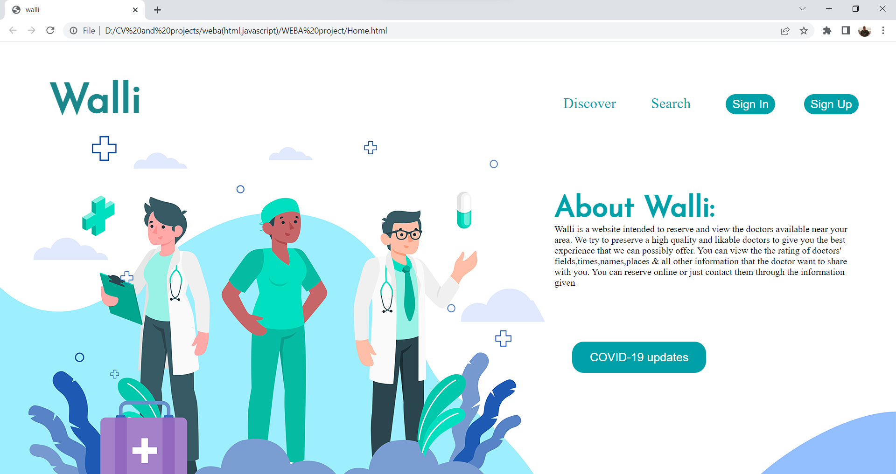
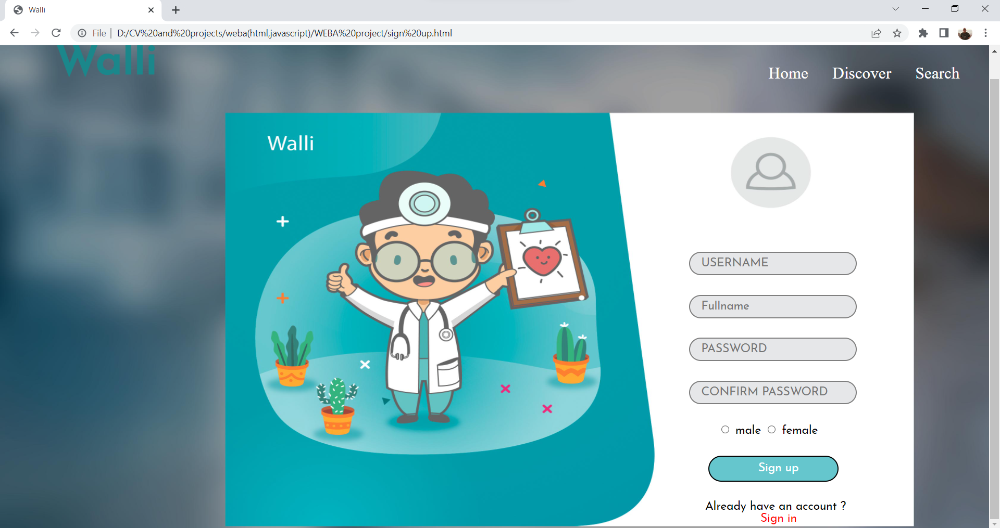
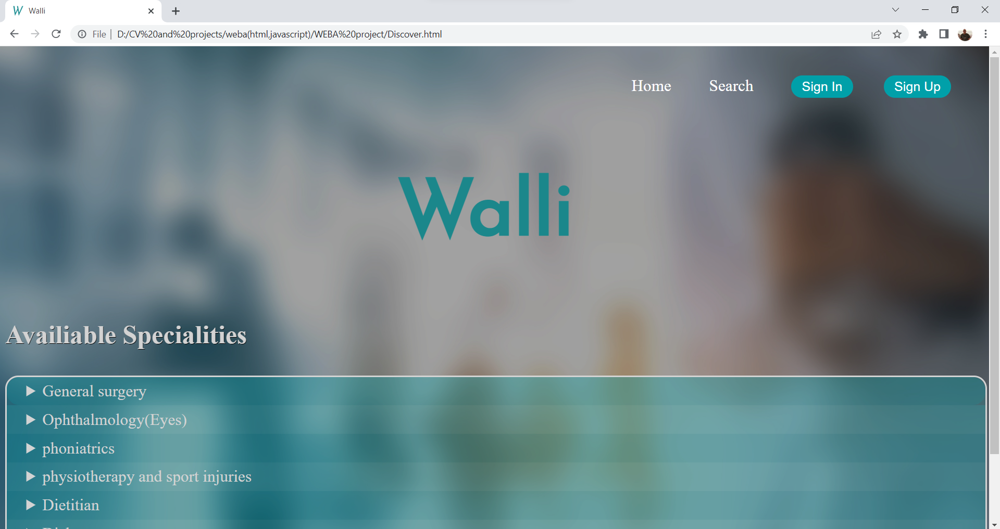
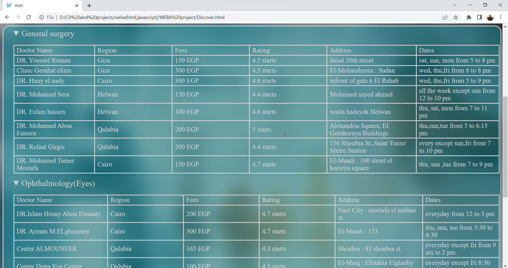
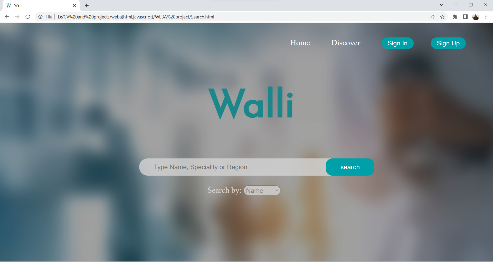
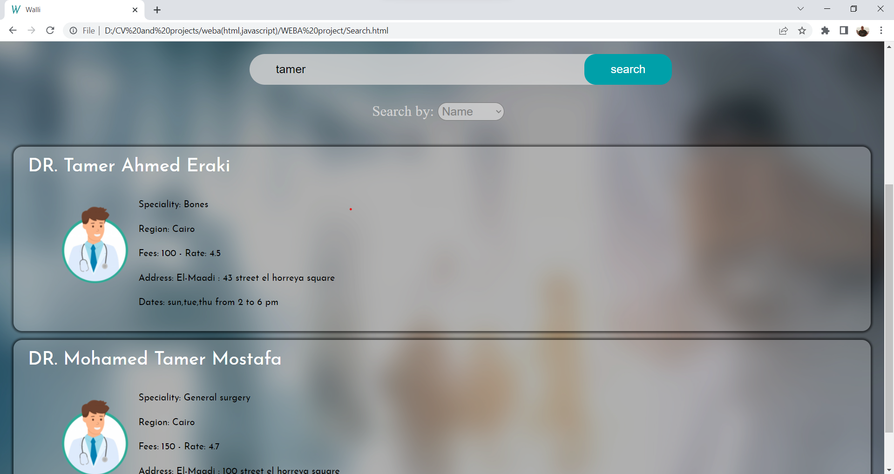
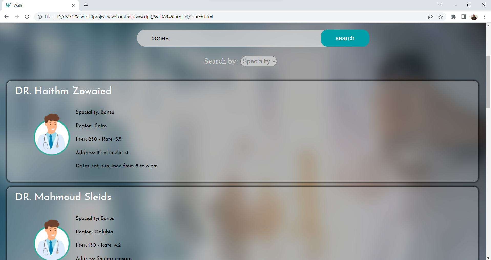
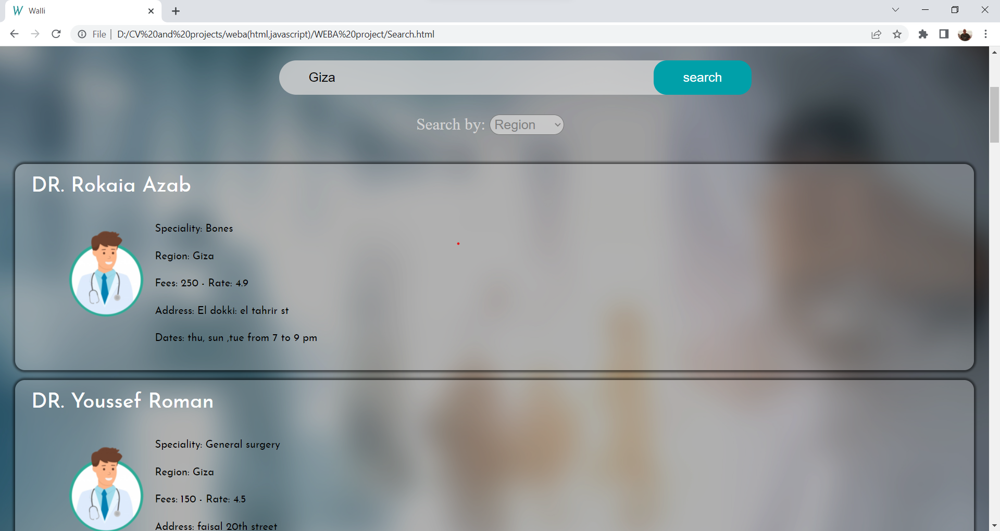
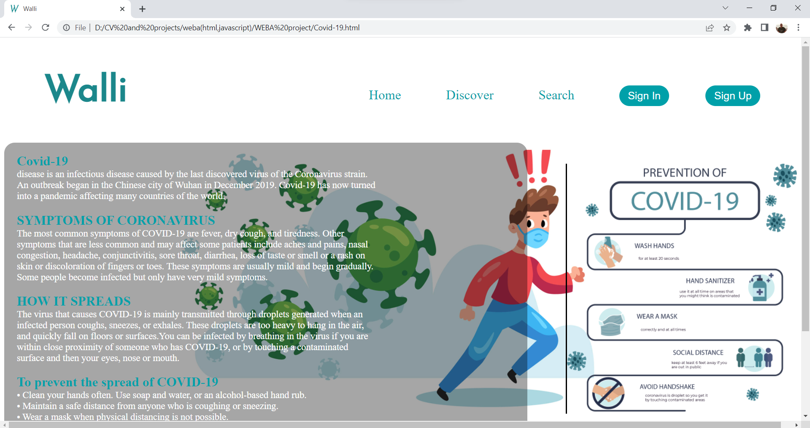

# Walli-Website-
Languages used : Html , CSS , JavaScript. 
Walli : This website is intended to reserve and view doctors available near a certain area. Users can filter by specialty and view the doctors’ rating, available slots, and information; including name and location.
summer training project 2020

